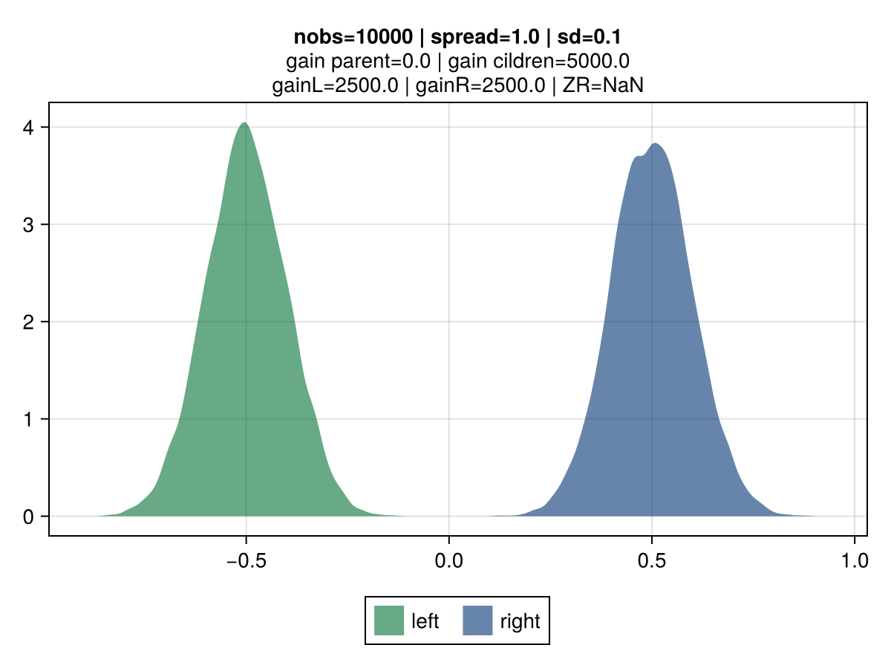

# Exploring a credibility-based approach for tree-gain estimation


The motivation for this experiment stems from potential shortfalls in approach used in gradient-boosted trees to assess the best split potential.

The figures below illustrate the behavior of vanilla gradient-based approach using a mean-squarred error (MSE) loss.
The 2 colors represent the observations belonging to the left and right children.

Key observations:
- **the gain is invariant to the volatility**: the top vs bottom figures differs only by the std dev of the observations.
    The associated gain is identical, which is aligned with the gradient-based approach to gain: the gain matches the reduction in the MSE, which is identical regardless of the dispersion. It's strictly driven by their mean.
- **the gain scales linearly with the number of observations**: the right vs left figures contrasts different number of observations (100 vs 10k), and show that gain is directly proportional.

````julia
loss = :mse
````

|  |  |
|:----------------------:|:----------------------:|
|  |  |

## Credibility-based gains

The idea is for the *gain* to reflect varying uncertainty levels for observations associated to each of the tree-split candidates.
For tree-split candidates with an identical spread, the intuition is that split-candidates with a lower volatility, all other things being equal, should be preferred.
The original inspiration comes from credibility theory, a foundational notion in actuarial science with direct connexion mixed effect models and bayesian theory.
Key concept is that the credibility associated with a set of observations is driven by the relative effect of 2 components:
 - **Variance of the Hypothetical Means (VHM)**: if large differences between candidates are expected, then a greater credibility will be assigned to that candidate.
 - **Expected Value of the Process Variance (EVPV)**: if the data generation process of a given candidate has a large volatility, a  smaller credibility will be assigned.

````julia
loss = :credV1A
````

|  |  |
|:----------------------:|:----------------------:|
|  |  |

credibility figures

````julia
# simulation grid
sd = 1.0
nobs_list = Int.(10.0 .^ (0:6))
nobs_list[1] = 2
spread_list = [0.001, 0.01, 0.1, 0.5, 1, 2, 10, 100]

````

|  |  |
|:----------------------:|:----------------------:|
|  |  |

