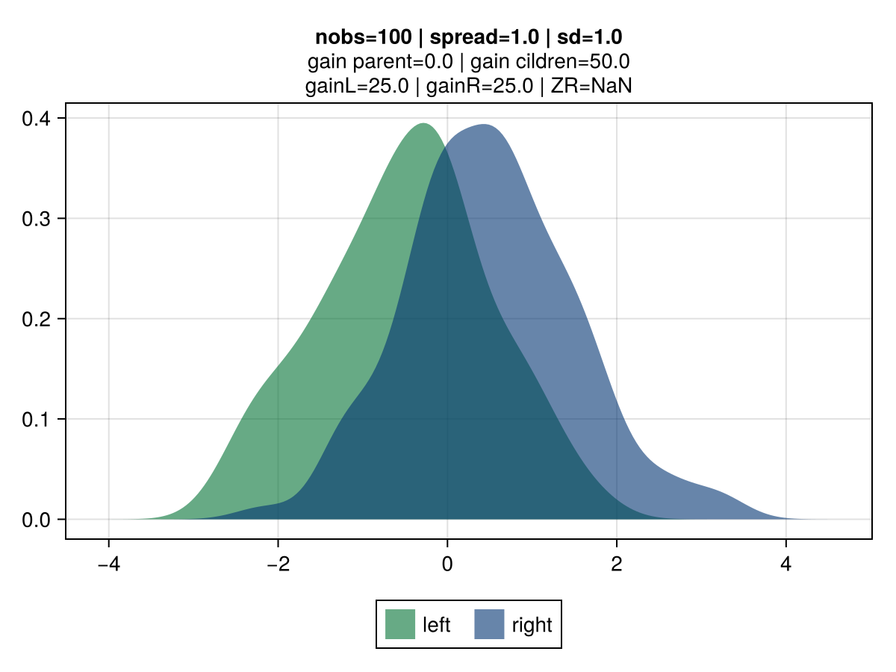
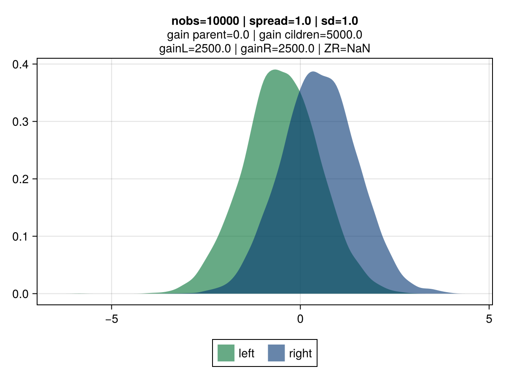
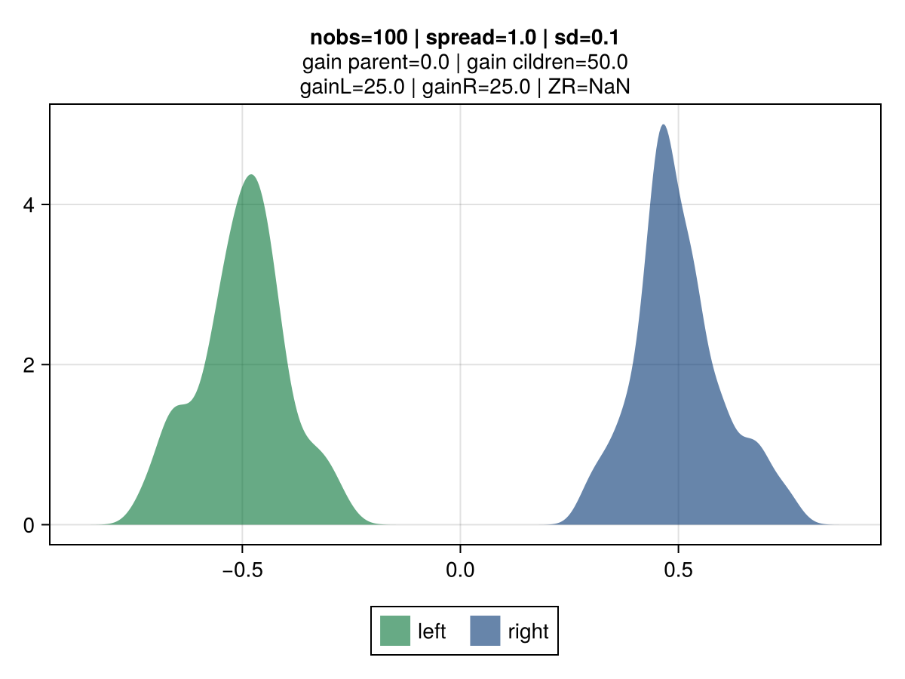
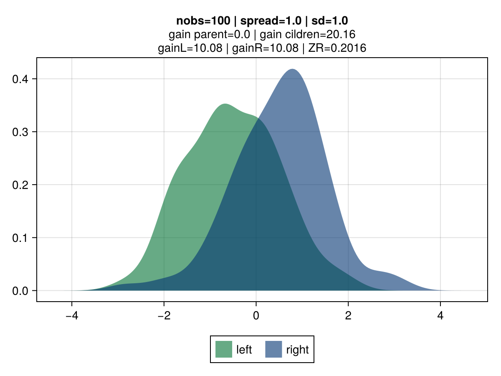
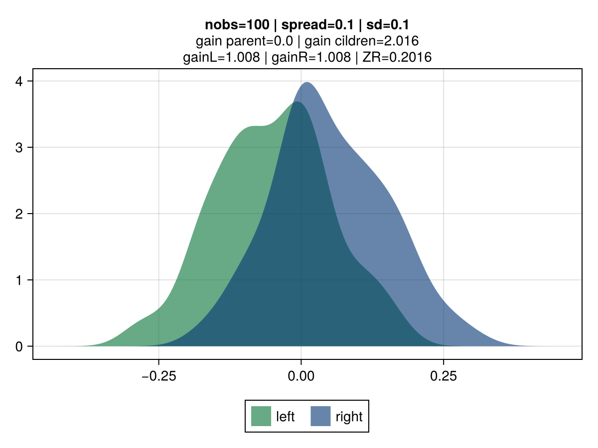
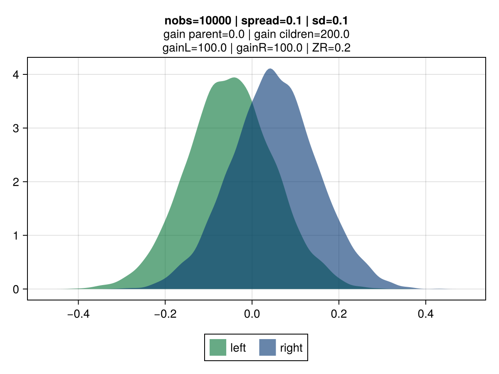

# Exploring a credibility-based approach for tree-gain estimation


> The motivation for this experiment stems from potential shortfalls in approach used in gradient-boosted trees to assess the best split potential.

The figures below illustrate the behavior of vanilla gradient-based approach using a mean-squarred error (MSE) loss.
The 2 colors represent the observations belonging to the left and right children.

Key observations:
- **the gain is invariant to the volatility**: the top vs bottom figures differs only by the std dev of the observations.
    The associated gain is identical, which is aligned with the gradient-based approach to gain: the gain matches the reduction in the MSE, which is identical regardless of the dispersion. It's strictly driven by their mean.
- **the gain scales linearly with the number of observations**: the right vs left figures contrasts different number of observations (100 vs 10k), and show that gain is directly proportional.
- **the gain scales quadratically with the size of the spread**: moving from a spread of 1.0 to 0.1 between the 2nd and 3rd row results in a drop by 100x of the gain: from 50.0 to 0.5.


|  |  |
|:----------------------:|:----------------------:|
|  |  |
|  |  |

## Credibility-based gains

The idea is for the *gain* to reflect varying uncertainty levels for observations associated to each of the tree-split candidates.
For tree-split candidates with an identical spread, the intuition is that split-candidates with a lower volatility, all other things being equal, should be preferred.
The original inspiration comes from credibility theory, a foundational notion in actuarial science with direct connexion mixed effect models and bayesian theory.
Key concept is that the credibility associated with a set of observations is driven by the relative effect of 2 components:
 - **Variance of the Hypothetical Means (VHM)**: if large differences between candidates are expected, then a greater credibility will be assigned to that candidate.
 - **Expected Value of the Process Variance (EVPV)**: if the data generation process of a given candidate has a large volatility, a  smaller credibility will be assigned.

This approach results in a shift of perspective in how the gain is derived.
Classical gradient based is about deriving a second-order approximation of the loss curve for a tre-split candidate.
The gain corresponds to the reduction in this approximated loss by taking the prediciton that minimises the quadratic loss curve.

The credibility-based takes a loss function agnostic approach, and view the gain as the total absolute change in the credibility-adjusted predicted value.
Example, if a child has a mean residual of *2.0*, credibility of 0.5 and 100 observations, the resulting gain is: `2.0 * 0.5 * 100 = 100.0`, where `2.0 * 0.5` corresponds to the credibility adjusted prediction.

VHM is estimated as the square of the mean of the spread between observed values and predictions: `mean(y - p)`.
EVPV is estimated as the variance of the observations. This value can be derived from the aggregation of the first (`y - p`) and second (`(y - p)^2`) moment of the individual observations:
 - `EVPV = E[(x - μ)^2] = E[X^2] - E[X]^2

### Credibility-based gains - credV1A
Same as for the previous the gradient-based MSE error, the gain grows linearly with the number of observations, all other things being equal.
However, a smaller volatility results in an increased gain, as shown in 2nd vs 1st row.


|  |  |
|:----------------------:|:----------------------:|
|  |  |
|  |  |

### Credibility-based gains - credV2A
This approach is a variation where the credibility is computed from std deviation rather than variance measures.


|  |  |
|:----------------------:|:----------------------:|
|  |  |
|  |  |

## Credibility figures

Four credibility variations are being tested:
 - **credV1A**: `VHM / VHM + EVPV`
 - **credV1B**: `VHM / VHM + EVPV / N`
 - **credV2A**: `sqrt(VHM) / sqrt(VHM) + sqrt(EVPV)`
 - **credV2B**: `sqrt(VHM) / sqrt(VHM) + sqrt(EVPV / N)`

The figures below present the credibility factor associated with different spreads and number observations

````julia
# simulation grid
sd = 1.0
nobs_list = Int.(10.0 .^ (0:6))
nobs_list[1] = 2
spread_list = [0.001, 0.01, 0.1, 0.5, 1, 2, 10, 100]
````

|  |  |
|:----------------------:|:----------------------:|
|  |  |

````julia
# simulation grid
nobs = 100
sd_list = [0.1, 0.2, 0.5, 1.0, 2.0, 10.0]
spread_list = [0.001, 0.01, 0.1, 0.5, 1, 2, 10, 100]
````

|  |  |
|:----------------------:|:----------------------:|
|  |  |

## Results

From [MLBenchmarks.jl](https://github.com/Evovest/MLBenchmarks.jl).

