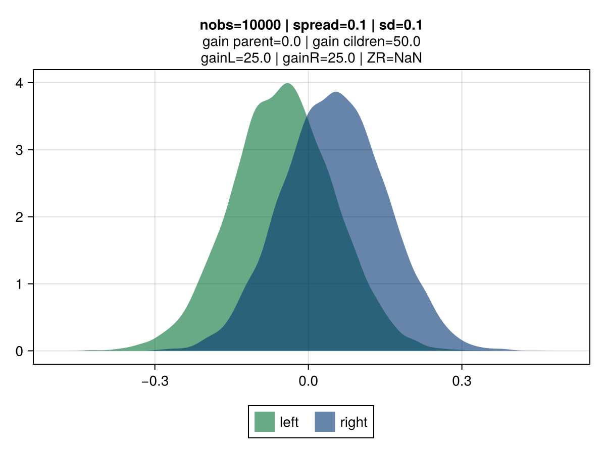

# Exploring a credibility-based approach for tree-gain estimation


````
get_cred_figure (generic function with 1 method)
````

The motivation for this experiment stems from potential shortfalls in approach used in gradient-boosted trees to assess the best split potential.

## MSE gains

````julia
loss = :mse

f = get_dist_figure(; loss, nobs=100, spread=1.0, sd=1.0)
save(joinpath(@__DIR__, "assets", "dist-mse-1.png"), f)
f = get_dist_figure(; loss, nobs=10_000, spread=1.0, sd=1.0)
save(joinpath(@__DIR__, "assets", "dist-mse-2.png"), f)

f = get_dist_figure(; loss, nobs=100, spread=1.0, sd=0.1)
save(joinpath(@__DIR__, "assets", "dist-mse-1B.png"), f)
f = get_dist_figure(; loss, nobs=10_000, spread=1.0, sd=0.1)
save(joinpath(@__DIR__, "assets", "dist-mse-2B.png"), f);
````

|  |  |
|:----------------------:|:----------------------:|
|  |  |

## Credibility-based gains

The idea is for the *gain* to reflect varying uncertainty levels for observations associated to each of the tree-split candidates.

````julia
loss = :credV1A

f = get_dist_figure(; loss, nobs=100, spread=1.0, sd=1.0)
save(joinpath(@__DIR__, "assets", "dist-cred-2.png"), f)
f = get_dist_figure(; loss, nobs=10_000, spread=1.0, sd=1.0)
save(joinpath(@__DIR__, "assets", "dist-cred-3.png"), f);

f = get_dist_figure(; loss, nobs=100, spread=1.0, sd=0.1)
save(joinpath(@__DIR__, "assets", "dist-cred-2B.png"), f)
f = get_dist_figure(; loss, nobs=10_000, spread=1.0, sd=0.1)
save(joinpath(@__DIR__, "assets", "dist-cred-3B.png"), f);
````

|  |  |
|:----------------------:|:----------------------:|
|  |  |

credibility figures

````julia
sd = 1.0
nobs_list = Int.(10.0 .^ (0:6))
nobs_list[1] = 2
spread_list = [0.001, 0.01, 0.1, 0.5, 1, 2, 10, 100]

f = get_cred_figure(; loss=:credV1A, sd, nobs_list, spread_list)
save(joinpath(@__DIR__, "assets", "heatmap-credV1A.png"), f);
f = get_cred_figure(; loss=:credV2A, sd, nobs_list, spread_list)
save(joinpath(@__DIR__, "assets", "heatmap-credV2A.png"), f);

f = get_cred_figure(; loss=:credV1B, sd, nobs_list, spread_list)
save(joinpath(@__DIR__, "assets", "heatmap-credV1B.png"), f);
f = get_cred_figure(; loss=:credV2B, sd, nobs_list, spread_list)
save(joinpath(@__DIR__, "assets", "heatmap-credV2B.png"), f);
````

|  |  |
|:----------------------:|:----------------------:|
|  |  |

